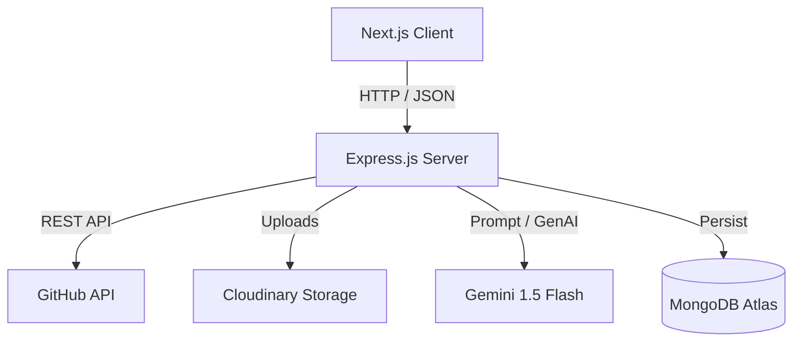
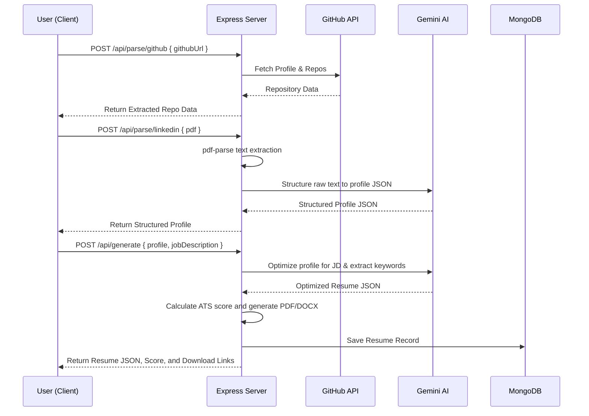

# Architecture Specification - NexusAI

This document outlines the system architecture, component design, data flow, and database models for NexusAI, the ATS Resume Generator.

---

## 1. System Topology

NexusAI is designed with a decoupled frontend (client) and backend (server) architecture:

- **Client**: Next.js 14 Web Application running on port 3000. It manages authentication, user forms, wizard flow, and visualizes generated resumes/scores.
- **Server**: Express Node.js application running on port 5000. It performs heavy lifting like web scraping/parsing, PDF/DOCX generation, database CRUD operations, and AI integration.

---

## 2. Component Design & Directory Structure

### 2.1 Client (Next.js App Router)
- `app/page.jsx`: Landing and multi-step Wizard Form (GitHub URL, LinkedIn PDF upload, Job Description).
- `app/result/page.jsx`: Visual resume workspace showcasing the parsed data, optimized output, and ATS Score Card.
- `app/history/page.jsx`: List of historically generated resumes for the logged-in user.
- `components/`: UI components (e.g. `InputForm`, `LoadingSteps`, `AtsScoreCard`, `ResumePreview`).

### 2.2 Server (Express API)
- **Routes**:
  - `parse.routes.js`: Handlers for parsing GitHub profiles and LinkedIn PDFs.
  - `generate.routes.js`: Invokes Gemini AI to build the optimized resume and calculate scores.
  - `resume.routes.js`: Performs database CRUD operations for resume history.
- **Services**:
  - `github.service.js`: GitHub user and repo detail fetching.
  - `pdf.service.js`: Extracting raw text from LinkedIn exports.
  - `gemini.service.js`: Structures raw text and executes optimization prompts.
  - `puppeteer.service.js` & `docx.service.js`: Generate downloadable files from HTML templates.
  - `cloudinary.service.js`: Handles temporary storage of generated documents.
  - `ats.service.js`: Analyzes keyword inclusion and calculates ATS score matches.

---

## 3. Data Flow

### 3.1 Resume Generation Pipeline

---

## 4. Database Schema Specification

### 4.1 User Schema (`User.model.js`)
- `email` (String, Unique, Required)
- `password` (String, Required for credential login)
- `name` (String)
- `createdAt` (Date)

### 4.2 Resume Schema (`Resume.model.js`)
- `userId` (ObjectId, Ref: User)
- `personalInfo` (Object)
  - `name`, `email`, `phone`, `website`, `linkedin`, `github`
- `experience` (Array)
  - `company`, `role`, `startDate`, `endDate`, `highlights`
- `projects` (Array)
  - `title`, `description`, `technologies`, `url`, `stars`
- `skills` (Array of Strings)
- `atsScore` (Number)
- `atsScoreBefore` (Number)
- `matchedKeywords` (Array of Strings)
- `missingKeywords` (Array of Strings)
- `jobTitle` (String)
- `pdfUrl` (String)
- `docxUrl` (String)
- `createdAt` (Date)
